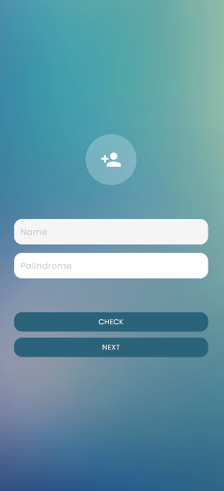
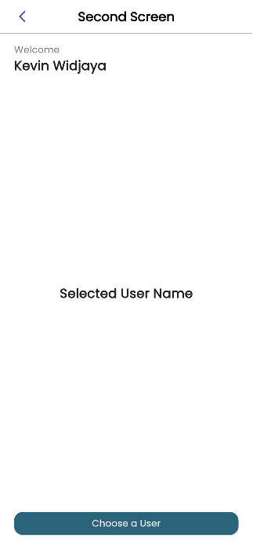
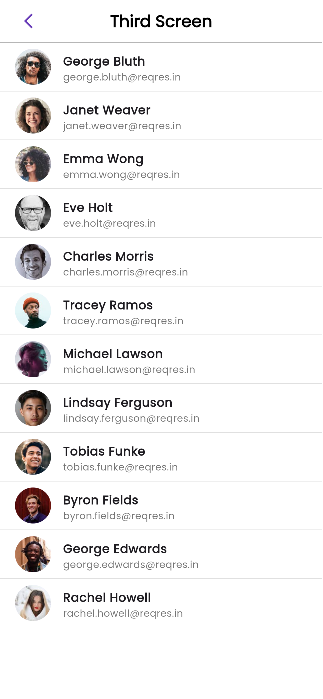

🚀 Suitmedia Test
Sebuah proyek Flutter yang dikembangkan sebagai bagian dari proses seleksi di Suitmedia. Aplikasi ini terdiri dari tiga layar utama:

Input Screen – Pengguna dapat memasukkan nama dan sebuah kalimat untuk dicek apakah merupakan palindrome.

Second Screen – Menampilkan nama pengguna yang telah diinput sebelumnya, serta tombol navigasi untuk memilih user.

Third Screen – Menampilkan daftar user dari API https://reqres.in dengan fitur:

Pull to refresh

Pagination saat scroll

🔧 Teknologi yang Digunakan
Flutter 

Dart

State Management: Provider 

HTTP: untuk mengambil data dari API eksternal

| First Screen | Second Screen | Third Screen |
|--------------|----------------|---------------|
|  |  |  |
